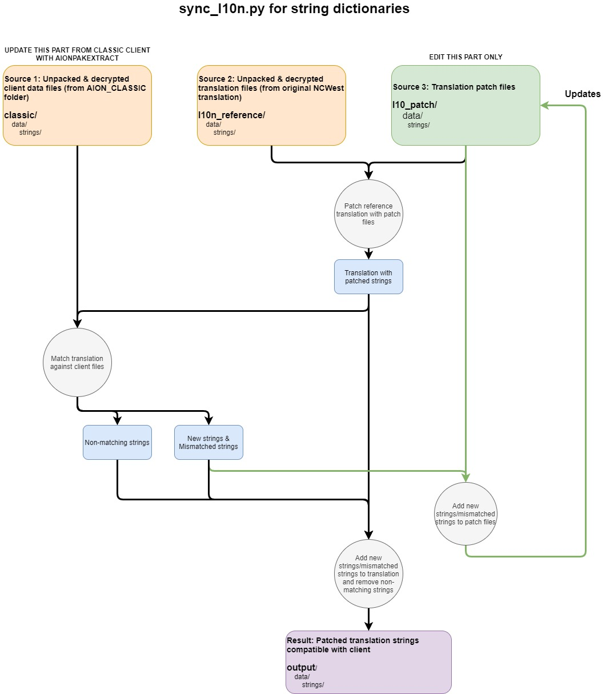

aion-classic-english-patch
==========================
English patch for Aion Classic on South Korean servers

Important
---------

This package is for developers, if you simply want to install the translation pack in your game, head to Releases!

Requires
--------
- Python 3.8+ to run sync_l10n.py
- A good text editor (Notepad++, Sublime Text...) as XML files encoding should be UTF-16/UCS-2 Little Endian with BOM

Workflow
--------

Generating output folder
------------------------

1. Run sync_l10n.py

Updating with new aion client files
-----------------------------------

1. Using AionPAKExtract, extract/decrypt client files into classic\
- AION_CLASSIC\data\strings\strings.pak -> client\strings
- AION_CLASSIC\data\ui\ui.pak -> client\ui

2. Run sync_l10n.py

Translating strings dictionaries
--------------------------------

1. Edit xml files in l10n_patch\data\strings
   /!\ XML files must be encoded in UTF-16/UCS-2 Little Endian with BOM
   (Using notepad++ is a good idea)

2. Run sync_l10n.py
